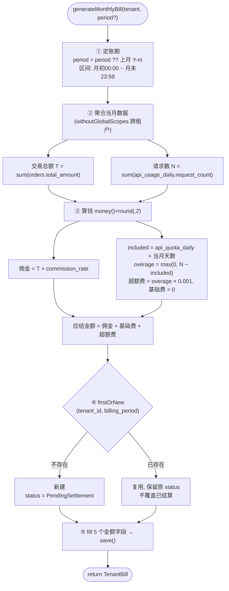

#### Redis 计数在当前项目中的使用
1. 通过api请求中间件`ApiRateLimitMiddleware`(别名`api.rate`)来做每日请求计数。除了登陆认证之外的其他接口，都需要走这个中间件。
2. 通过`Redis::incr`来实现计数， 通过`Redis::get`来获取计数
3. 如果是基础套餐，计数超过限制，则阻断请求，返回429错误。如果是专业/企业版，计数超过限制 * 1.5，则阻断请求，返回429错误。
4. 在`ApiUsageFlushJob`中，每天凌晨0点汇总昨天的Redis请求计数，并写入表`api_usage_daily`表中,用于统计昨天的请求用量。成功，则写入`queue_job_logs`表中，失败则写入`queue_job_log`表中。

#### Redis 锁在当前项目中的使用
1. 生成租户账单时，需要加锁，避免并发生成多个账单。（key 是 tenant_id + period， value 是token，token 是随机字符串）加锁返回一个token值，后续释放锁时需要传递这个token值
2. 使用的是lua脚本实现的分布式锁，同时支持超时时间，默认10分钟。
当账单生成完成后，会判断当前进程的Redis中的锁的值，和加锁时返回的token值是否一致，一致，才释放锁，删除锁的key
3. 

> 生成租户账单逻辑图如下所示：
```text
 generateMonthlyBill(Tenant $tenant, ?string $period)
 ─────────────────────────────────────────────────────
 ① 定账期 / 时间区间
    period  = period ?? 上个月 ('Y-m')        ← defaultPeriod(): subMonthNoOverflow
    start   = 当月 1日 00:00:00
    end     = 当月末 23:59:59
                       │
                       ▼
 ② 聚合当月数据   (全部 withoutGlobalScopes → 跨租户平台视角)
    ┌───────────────────────────────────────────────────────────┐
    │ Order        sum(total_amount) where created_at ∈ [start,end]  → 交易总额 T │
    │ ApiUsageDaily sum(request_count) where usage_date  ∈ 当月      → 请求数   N │
    └───────────────────────────────────────────────────────────┘
                       │
                       ▼
 ③ 算钱  (money() = round(, 2))
    佣金      = T × tenant.commission_rate
    included  = package.api_quota_daily × 当月天数
    overage   = max(0, N − included)
    超额费    = overage × 0.001            API_OVERAGE_UNIT_PRICE
    基础费    = 0.0                        (api_usage_fee 写死)
    应结金额  = 佣金 + 基础费 + 超额费
                       │
                       ▼
 ④ 幂等落库   firstOrNew([ tenant_id , billing_period = period ])
                       │
              ┌────────┴────────┐
              ▼                 ▼
         已存在 → 复用       不存在 → 新建
         (保留原 status,     status = PendingSettlement
          不覆盖已结算)
              └────────┬────────┘
                       ▼
 ⑤ fill 五个金额字段
    transaction_total / commission_amount /
    api_usage_fee / api_overage_fee / total_receivable
    → save()
                       │
                       ▼
                return TenantBill
```

