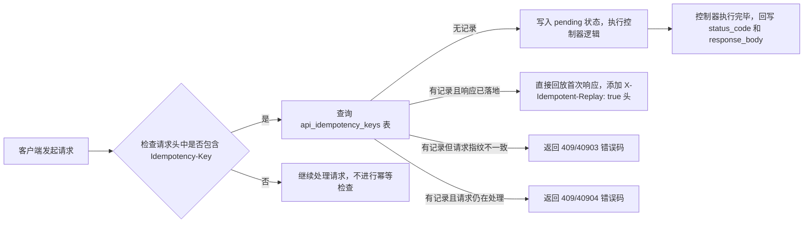

#### 项目业务背景与功能总览

> 写在前面：这一部分讲清楚「这个项目是干什么的、给谁用、怎么赚钱、有哪些功能」，先建立业务全景，再看下面的技术亮点就不迷路了。内容依据当前代码实际实现整理（截至 2026-09）。

##### 一句话定位

一套**多商户 SaaS 电商开放中台**：平台方把电商经营能力以「订阅套餐」的方式租给多个商户使用，同时提供一套**开放 API**，让商户自己的外部系统（ERP / 进销存 / OMS）能直接和平台对接。

##### 一个帮助定位的类比

- **业务模式**上更像**有赞 / 微盟**这类电商 SaaS：商户租店铺经营，平台收订阅费和交易佣金；
- **API 网关那一层**（密钥、配额、计量、计费）技术上和**智谱 / DeepSeek 开放平台**是同一套问题域：app_key 换 Token、按套餐配额限流、超额计费、用量落库日结；
- 区别在于：模型开放平台的 API 就是商品本身（按 token 计费）；本项目的商品是电商 SaaS 后台，开放 API 只是让商户 ERP 对接的补充通道。风控（刷单/高退款率）、月结对账、商户入驻审核这些是电商域特有的。

##### 业务背景：解决什么问题

- 中小商户想开线上店，自建一套完整电商系统（商品、订单、营销、对账）的开发和维护成本太高；
- 市面上很多 SaaS 商城是封闭的，商户的 ERP 想同步商品、推送订单，没有正规通道，只能人工搬数据；
- 从平台方视角，需要统一管控：商户入驻审核、套餐计费、API 调用配额、风控、月度对账，这些靠人肉表格管不住。

所以本项目的定位是把三件事装进一个系统：**平台管商户和钱，商户管店铺和货，外部系统走开放 API 打数据**。

##### 三类使用者

| 角色 | 入口 | 干什么 |
|------|------|--------|
| 平台运营 | `/platform` | 商户入驻/启停、套餐配置、API 监控、风控对账、队列运维 |
| 商户 | `/merchant` | 商品、订单、优惠券、API 密钥、月度账单 |
| 外部系统 | `/api/v1` | 用 app_key/app_secret 换 Token 后同步商品、推订单、查账单 |

另外平台运营可以用 **Impersonation（代登录）** 以某个商户的身份进入商户后台排查问题，全程写 `impersonation_logs` 审计。

##### 商业模式（平台怎么收钱）

1. **套餐订阅费**：基础 / 专业 / 企业三档（`PackageTier`），已实现订阅支付闭环（checkout → 支付 → Webhook 激活）；
2. **交易佣金**：月结时按商户当月交易总额 × 佣金率（默认 2%）；
3. **API 超额费**：专业/企业版超出日配额的部分计费（软告警 + 超额计费，到 1.5 倍配额才硬阻断）；基础版超额直接 429 阻断。

##### 核心功能清单

**一、平台管理后台（Filament，`/platform`）**

- 商户管理：入驻审核、启用/禁用、套餐变更（变更记录进 `package_change_logs`）
- 套餐配置：API 日配额、佣金率、价格档位
- 平台角色权限：角色 → 权限点
- 4 个 Vue3 + Echarts 数据面板：全平台经营看板、API 全局监控、队列调度中心、对账风控
- Impersonation 代登录 + 审计

**二、商户管理后台（Filament，`/merchant`）**

- 商品管理：底层 SPU+SKU 模型，本期单 SKU 交互，支持上下架
- 订单管理：状态机推进（见下方订单状态机），取消 / 退款
- 营销优惠：满减 / 折扣券
- API 密钥：app_key/app_secret 发放、权限点勾选（product_query / order_manage / bill_query / dashboard_read / subscription_manage）
- 月度账单查询、操作日志

**三、开放 API（`/api/v1`，给外部系统）**

- 鉴权：app_key + app_secret 换双 Token（access 2 小时 / refresh 30 天），Sanctum abilities 做权限点
- 接口分组（当前路由）：auth 3 个、products 5 个、orders 6 个、bills 2 个、subscription 2 个、dashboard 2 个、支付 webhook 1 个
- 中间件链：请求日志/链路追踪（api.log，最外层）→ 统一异常 → 认证 → IP 黑白名单 → 签名（HMAC-SHA256）→ 防重放（±300s 时间窗 + nonce 唯一约束）→ 幂等（Idempotency-Key）→ 日配额限流
- 统一 `{code, message, data}` 响应结构 + 业务错误码

**四、订阅支付闭环（较新的模块）**

- 查询当前订阅 `GET /subscription`；创建支付单 `POST /subscription/checkout`
- 支付渠道隔离在 `PaymentGateway` 接口后，当前是 Mock 网关跑通链路，后续接 Stripe / 微信 H5 不用动领域状态机
- Webhook 验签 → `ProcessPaymentWebhookJob` 异步处理 → 同一事务内激活订阅 / 变更租户套餐
- 幂等双保险：webhook 事件 `(provider, event_id)` 唯一；支付单 `(tenant_id, idempotency_key)` 唯一

**五、后台看不见的支撑能力（项目的深水区）**

- 多租户隔离：TenantContext（readonly）+ TenantScope + SqlTenantGuard + Octane 清理中间件 + `BelongsToTenant` trait，共享库模式下防串号
- Redis 基础设施：Lua 分布式锁、滑动窗口限流、延迟队列、死信队列、API 日计数
- 队列 Job（9 个）：订单超时关闭（30 分钟）、月结账单（每月 1 日 02:00）、API 用量落库（每日 00:05）、风控扫描（每小时）、欢迎邮件、库存预警、物流同步、API 账单生成、支付 Webhook 处理
- 风控规则引擎：高频下单 / 高退款率 / 异地登录 / 重复支付 / API 激增，命中写 `risk_alerts` 由运营处理
- 月结半自动对账：平台应收自动算，商户上报金额运营填，差额自动生成差异单

##### 订单状态机（业务主流程）

```
pending_payment ──► paid ──► shipped ──► completed
       │               │
       │               └──► refund_requested ──► completed / cancelled
       └──► cancelled（30 分钟未支付由延迟队列 Job 自动关单 / 手动取消）
```

##### 一条典型的业务主线（把所有模块串起来）

1. 商户入驻 → 选套餐 → 平台审核开通 → 发欢迎邮件（异步 Job）
2. 商户在后台维护商品、优惠券；或者用 API 密钥从 ERP 里同步商品、推送订单
3. 消费者下单 → `pending_payment`；30 分钟未支付，Redis 延迟队列触发 Job 自动关单
4. 支付 → `paid` → 发货 `shipped` → 完成 `completed`；期间风控 Job 每小时扫描（刷单、高退款率等）
5. 每月 1 日月结 Job 汇总上月交易，生成账单（佣金 + API 超额费）→ 运营做半自动对账
6. 商户要升级套餐 → checkout 创建支付单 → 网关回调 Webhook（验签 + 幂等）→ 事务内激活新套餐

##### 技术栈

PHP 8.3 · Laravel 11 · Filament v3 · Vue3 + Echarts · MySQL 8 · Redis（predis 客户端）· Octane（Swoole 驱动，docker/start-app.sh 已投产）
（常驻进程的租户串号防护见 `OctaneTenantCleanupMiddleware` 与 `SqlTenantGuard`，普通 HTTP 模式下同样生效）

##### 延伸阅读

- 总体设计（SDD）：`docs/superpowers/specs/2026-07-02-saas-ecommerce-platform-design.md`
- 微信 H5 支付 Webhook 设计：`docs/superpowers/specs/2026-08-03-wechat-h5-payment-webhook-design.md`
- 请求日志与链路追踪：`docs/summary/项目中的API网关 请求日志与链路追踪.md`
- 分层架构 / 队列 / 账单 / 订阅支付 / Vue 面板：`docs/architecture/*.md`
- 数据库：`docs/database/`，API 规范：`docs/api/`

---

#### 当前项目中的亮点和值得学习的地方
##### Octane 下的多租户隔离与防串号
1. 处理多租户的方法，封装了四个中间件。`ResolveTenantContext`、`ApplyTenantGlobalScope`、
`SqlTenantGuard`、
`OctaneTenantCleanup`、
`ApiAuthMiddleware`

租户上下文对象，包括租户ID、套餐等级、真实用户ID等。

`ResolveTenantContext`用于在全局app容器中注册`TenantContext`类的字符串，对应的对象。这个注册是单例可复用的。`ApplyTenantGlobalScope`用于兜底逻辑，用于将Context 类，解析到默认的租户上下文对象上（套餐是Basic套餐）`ApiAuthMiddleware`用于从登陆用户的请求中解析租户ID并生成`TenantContext`对象，同时更新注册对象到`TenantContext`类字符串中。`SqlTenantGuard`用于在SQL查询中添加租户ID的过滤条件，确保每个`DELETE`和`UPDATE`语句都包含`tenant_id`字符串.
`OctaneTenantCleanup`用于在Octane中清理租户ID，确保租户信息跨请求存在

2. 处理多租户的时候，封装了一个trait `BelongsToTenant`,定义了`bootBelongsToTenant`的静态方法，这个trait 会被很多模型类引用。`bootBelongsToTenant`方法，注册了租户的Scope，也就是`TenantScope`,这样子在模型调用`all,get`等方法的时候，会自动调用`TenantScope`的`apply`方法。`bootBelongsToTenant`还注册了模型的`creating`事件，就是一个模型实例即将被INSERT到数据库之前触发

3. 使用Octane 常驻进程治理，提高了性能

##### 开放API的外部系统对接能力
1. 具有请求日志、认证、IP 黑白名单、签名、防重放、幂等、限流等多重能力，整体通过一条中间件链串联完成。执行顺序为 `api.log`（请求日志/链路追踪，最外层）→ `api.exception`（统一异常兜底）→ `api.auth` → `api.ip` → `api.signature` → `api.idempotent` → `api.rate`。其中 IP 名单、签名、幂等、限流四个中间件都依赖 `api.auth` 注入到 `$request->attributes` 中的 `api_key`。下面把这些能力逐个拆开说明。

2. 认证采用"`app_key` + `app_secret` 换 Sanctum Bearer Token"的模式。外部系统先用 `app_key`/`app_secret` 调 `/auth/token` 换一对令牌，核心逻辑在 `AccessTokenService::issueForCredentials`：按 `app_key` 查到启用状态的 `ApiKey`，用 `Hash::check` 校验 `app_secret`（库里存的是 bcrypt 哈希），通过后签发 access 与 refresh 两个 token，TTL 分别为 2 小时和 30 天；access token 的 Sanctum abilities 直接取自该密钥的 `permissions`（`product_query`/`order_manage`/`dashboard_read`/`bill_query` 等权限点）。后续每次请求带 `Authorization: Bearer <access_token>`，由 `ApiAuthMiddleware`（别名 `api.auth`）校验 token 名称是否为 `api-access`、是否过期，再用 `$token->can($permission)` 做权限点检查，最后把 `api_key` 注入 request attributes，并把含套餐档位的 `TenantContext` 绑定到容器（与后台 Session 完全隔离）。

3. 签名算法集中在 `ApiRequestSigner`。"规范化请求串"按固定顺序拼六行：大写 HTTP 方法、请求路径、规范化 query（按 key `ksort` 后做 RFC3986 编码）、`X-Timestamp`、`X-Nonce`、请求体的 `sha256`；最终签名 `X-Signature = hash_hmac('sha256', 规范化请求串, signing_secret)`。客户端需同时带 `X-App-Key`/`X-Timestamp`/`X-Nonce`/`X-Signature` 四个头。`ApiSignatureMiddleware` 依次校验：app_key 与密钥一致、时间戳与服务端时钟偏差不超过 ±300 秒、nonce 格式合法，再用 `hash_equals` 做定长字符串比对（防时序攻击）。写接口才强制签名，GET 查询类不要求。

4. 防重放嵌在签名中间件里，靠"时间戳窗口 + nonce 唯一约束"实现。每个 nonce 写入 `api_signature_nonces` 表，该表有 `unique(api_key_id, nonce)` 约束；`reserveNonce` 先顺带删掉该密钥下已过期的 nonce，再 insert 当前 nonce，一旦触发唯一约束冲突（`QueryException`）即判定为重放，返回 409（业务码 40902）。nonce 保留时长与时间窗口一致（300 秒），过期即失效。

5. 幂等由独立的 `ApiIdempotencyMiddleware` 配合 `Idempotency-Key` 头完成，状态落在 `api_idempotency_keys` 表（`unique(tenant_id, idempotency_key)`）。它先用 `ApiRequestSigner::requestHash`（方法+路径+query+body 的 sha256，刻意不含时间戳/nonce）算出"请求指纹"，再分情况处理：无记录时先占位写入（pending，不存响应），控制器执行完再回写 `status_code` 和 `response_body`；若同 key 同请求且响应已落地，直接回放首次响应并加 `X-Idempotent-Replay: true` 头；若同 key 但"请求指纹"不一致（键被复用于不同请求），返回 409/40903；若同 key 请求仍在并发处理中，返回 409/40904。记录保留 1 天。

6. 限流采用"租户日配额"模式（而非 QPS 滑动窗口）。计数走 Redis：`ApiDailyCounter::increment` 用 `INCR` 写入 `saas:{tenantId}:api:daily:{日期}` 键，并在当日结束自动过期。`ApiRateLimitMiddleware` 每次请求先 `INCR` 再交给 `QuotaPolicyService` 判定是否阻断；配额优先取套餐 `api_quota_daily`，否则按档位兜底（基础版 1 万 / 专业版 10 万 / 企业版 100 万）。阻断策略分级——基础版用量到配额即硬阻断（429）；专业版/企业版在 [配额, 1.5×配额) 区间只软告警并超额计费，达到 1.5× 才硬阻断。平台全局视图（`tenantId=null`）不按租户配额拦截。Redis 计数仅用于实时阻断，账单对账由 `ApiUsageFlushJob` 每天 00:05 把昨日计数回写到 `api_usage_daily` 表。

7. 上述能力对外都通过 `ApiResponse` 统一的 `{code, message, data}` 结构返回，并配套一套业务错误码（如 40101 token 失效、40107 签名错误、40902 重放、40903/40904 幂等冲突、42901 超配额），便于外部系统按码精确处理。


##### ApiAuthMiddleware 具体请求流程
1. 从`header`头中取出`Authorization`字段，并截取`Bearer `后面的内容
2. 从`personal_access_tokens`表中查询, 表中有`token` 字段(用`sha256`加密后存进去的)，判断二者是否匹配，如果匹配，判断是否过期.(默认)
3. 如果过期或者不匹配，返回40101错误码
4. `personal_access_tokens`还存储`abilities`、`expires_at`等字段，判断是否有该权限点。如果用户没有这个权限，则返回40301错误码。
（如下所示， api.auth:product_query 表示需要 product_query 权限点）
```php
Route::middleware(['api.auth:product_query', 'api.rate'])->group(function () {
    Route::get('/products', [ProductController::class, 'index']);
    Route::get('/products/{product}', [ProductController::class, 'show']);
});
```
5. 读取`PersonalAccessToken`对象模型中的`tokenable`属性，获取`ApiKey`的模型，api_keys 表中有`tanent_id`字段，通过这个字段，关联`tenants`表中的`tenant_id`字段,`tenants`表中又有`package_id`字段，最后关联`packages`表，构建出`TenantContext`对象

#### 当前项目下的APi接口和对应的中间件
1. `/auth/token` 接口，用于获取 Bearer Token，需要`app_key`和`app_secret`参数, 返回`access_token`和`refresh_token`. 主要涉及表`api_keys`,会下发`last_used_at`字段
2. `/auth/token/refresh` 接口，用于刷新 Bearer Token
3. `/product`, `/order` 接口，都是产品和订单相关的接口

中间件的使用场景：
1. `api.auth`除了与认证、登陆有关的接口外，其他的接口，都需要这个中间件
2. `api.rate` 中间件，用于限流，根据租户ID和套餐等级，判断是否超配额，除了与认证、登陆有关的接口外，其他的接口，都需要这个中间件。与`api.auth`中间件，差不多，先执行`api.auth`中间件，再执行`api.rate`中间件。
3. `api.signature` 中间件，用于校验签名，防止重放攻击和签名错误。订单和产品的接口，涉及写操作的请求，都要走这个中间件
4. `api.idempotent` 中间件，用于处理幂等请求，防止重复请求。比如创建订单、创建产品、退款、发货推进等操作，都需要走这个中间件

##### ApiIdempotencyMiddleware 具体请求流程


