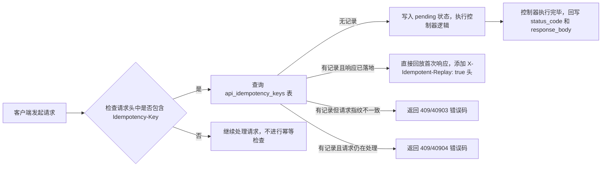

#### 当前项目中的亮点和值得学习的地方
##### Octane 下的多租户隔离与防串号
1. 处理多租户的方法，封装了四个中间件。`ResolveTenantContext`、`ApplyTenantGlobalScope`、`SqlTenantGuard`、`OctaneTenantCleanup`、`ApiAuthMiddleware`

租户上下文对象，包括租户ID、套餐等级、真实用户ID等。

`ResolveTenantContext`用于在全局app容器中注册`TenantContext`类的字符串，对应的对象。这个注册是单例可复用的。`ApplyTenantGlobalScope`用于兜底逻辑，用于将Context 类，解析到默认的租户上下文对象上（套餐是Basic套餐）`ApiAuthMiddleware`用于从登陆用户的请求中解析租户ID并生成`TenantContext`对象，同时更新注册对象到`TenantContext`类字符串中。`SqlTenantGuard`用于在SQL查询中添加租户ID的过滤条件，确保每个`DELETE`和`UPDATE`语句都包含`tenant_id`字符串.
`OctaneTenantCleanup`用于在Octane中清理租户ID，确保租户信息跨请求存在


2. 处理多租户的时候，封装了一个trait `BelongsToTenant`,定义了`bootBelongsToTenant`的静态方法，这个trait 会被很多模型类引用。`bootBelongsToTenant`方法，注册了租户的Scope，也就是`TenantScope`,这样子在模型调用`all,get`等方法的时候，会自动调用`TenantScope`的`apply`方法。`bootBelongsToTenant`还注册了模型的`creating`事件，就是一个模型实例即将被INSERT到数据库之前触发

3. 使用Octane 常驻进程治理，提高了性能

##### 开放API的外部系统对接能力
1. 具有认证、签名、防重放、幂等、限流等多重能力，整体通过一条中间件链串联完成。执行顺序为 `api.auth` → `api.signature` → `api.idempotent` → `api.rate`，最外层再套一个 `api.exception` 做统一异常兜底。其中签名、幂等、限流三个中间件都依赖 `api.auth` 注入到 `$request->attributes` 中的 `api_key`。下面把五个能力逐个拆开说明。

2. 认证采用"`app_key` + `app_secret` 换 Sanctum Bearer Token"的模式。外部系统先用 `app_key`/`app_secret` 调 `/auth/token` 换一对令牌，核心逻辑在 `AccessTokenService::issueForCredentials`：按 `app_key` 查到启用状态的 `ApiKey`，用 `Hash::check` 校验 `app_secret`（库里存的是 bcrypt 哈希），通过后签发 access 与 refresh 两个 token，TTL 分别为 2 小时和 30 天；access token 的 Sanctum abilities 直接取自该密钥的 `permissions`（`product_query`/`order_manage`/`dashboard_read`/`bill_query` 等权限点）。后续每次请求带 `Authorization: Bearer <access_token>`，由 `ApiAuthMiddleware`（别名 `api.auth`）校验 token 名称是否为 `api-access`、是否过期，再用 `$token->can($permission)` 做权限点检查，最后把 `api_key` 注入 request attributes，并把含套餐档位的 `TenantContext` 绑定到容器（与后台 Session 完全隔离）。

3. 签名算法集中在 `ApiRequestSigner`。"规范化请求串"按固定顺序拼六行：大写 HTTP 方法、请求路径、规范化 query（按 key `ksort` 后做 RFC3986 编码）、`X-Timestamp`、`X-Nonce`、请求体的 `sha256`；最终签名 `X-Signature = hash_hmac('sha256', 规范化请求串, signing_secret)`。客户端需同时带 `X-App-Key`/`X-Timestamp`/`X-Nonce`/`X-Signature` 四个头。`ApiSignatureMiddleware` 依次校验：app_key 与密钥一致、时间戳与服务端时钟偏差不超过 ±300 秒、nonce 格式合法，再用 `hash_equals` 做定长字符串比对（防时序攻击）。写接口才强制签名，GET 查询类不要求。

4. 防重放嵌在签名中间件里，靠"时间戳窗口 + nonce 唯一约束"实现。每个 nonce 写入 `api_signature_nonces` 表，该表有 `unique(api_key_id, nonce)` 约束；`reserveNonce` 先顺带删掉该密钥下已过期的 nonce，再 insert 当前 nonce，一旦触发唯一约束冲突（`QueryException`）即判定为重放，返回 409（业务码 40902）。nonce 保留时长与时间窗口一致（300 秒），过期即失效。

5. 幂等由独立的 `ApiIdempotencyMiddleware` 配合 `Idempotency-Key` 头完成，状态落在 `api_idempotency_keys` 表（`unique(tenant_id, idempotency_key)`）。它先用 `ApiRequestSigner::requestHash`（方法+路径+query+body 的 sha256，刻意不含时间戳/nonce）算出"请求指纹"，再分情况处理：无记录时先占位写入（pending，不存响应），控制器执行完再回写 `status_code` 和 `response_body`；若同 key 同请求且响应已落地，直接回放首次响应并加 `X-Idempotent-Replay: true` 头；若同 key 但"请求指纹"不一致（键被复用于不同请求），返回 409/40903；若同 key 请求仍在并发处理中，返回 409/40904。记录保留 1 天。

6. 限流采用"租户日配额"模式（而非 QPS 滑动窗口）。计数走 Redis：`ApiDailyCounter::increment` 用 `INCR` 写入 `saas:{tenantId}:api:daily:{日期}` 键，并在当日结束自动过期。`ApiRateLimitMiddleware` 每次请求先 `INCR` 再交给 `QuotaPolicyService` 判定是否阻断；配额优先取套餐 `api_quota_daily`，否则按档位兜底（基础版 1 万 / 专业版 10 万 / 企业版 100 万）。阻断策略分级——基础版用量到配额即硬阻断（429）；专业版/企业版在 [配额, 1.5×配额) 区间只软告警并超额计费，达到 1.5× 才硬阻断。平台全局视图（`tenantId=null`）不按租户配额拦截。Redis 计数仅用于实时阻断，账单对账由 `ApiUsageFlushJob` 每天 00:05 把昨日计数回写到 `api_usage_daily` 表。

7. 上述能力对外都通过 `ApiResponse` 统一的 `{code, message, data}` 结构返回，并配套一套业务错误码（如 40101 token 失效、40107 签名错误、40902 重放、40903/40904 幂等冲突、42901 超配额），便于外部系统按码精确处理。


##### ApiAuthMiddleware 具体请求流程
1. 从`header`头中取出`Authorization`字段，并截取`Bearer `后面的内容
2. 从`personal_access_tokens`表中查询, 表中有`token` 字段(用`sha256`加密后存进去的)，判断二者是否匹配，如果匹配，判断是否过期.(默认)
3. 如果过期或者不匹配，返回40101错误码
4. `personal_access_tokens`还存储`abilities`、`expires_at`等字段，判断是否有该权限点。如果用户没有这个权限，则返回40301错误码。
（如下所示， api.auth:product_query 表示需要 product_query 权限点）
```php
Route::middleware(['api.auth:product_query', 'api.rate'])->group(function () {
    Route::get('/products', [ProductController::class, 'index']);
    Route::get('/products/{product}', [ProductController::class, 'show']);
});
```
5. 读取`PersonalAccessToken`对象模型中的`tokenable`属性，获取`ApiKey`的模型，api_keys 表中有`tanent_id`字段，通过这个字段，关联`tenants`表中的`tenant_id`字段,`tenants`表中又有`package_id`字段，最后关联`packages`表，构建出`TenantContext`对象

#### 当前项目下的APi接口和对应的中间件
1. `/auth/token` 接口，用于获取 Bearer Token，需要`app_key`和`app_secret`参数, 返回`access_token`和`refresh_token`. 主要涉及表`api_keys`,会下发`last_used_at`字段
2. `/auth/token/refresh` 接口，用于刷新 Bearer Token
3. `/product`, `/order` 接口，都是产品和订单相关的接口

中间件的使用场景：
1. `api.auth`除了与认证、登陆有关的接口外，其他的接口，都需要这个中间件
2. `api.rate` 中间件，用于限流，根据租户ID和套餐等级，判断是否超配额，除了与认证、登陆有关的接口外，其他的接口，都需要这个中间件。与`api.auth`中间件，差不多，先执行`api.auth`中间件，再执行`api.rate`中间件。
3. `api.signature` 中间件，用于校验签名，防止重放攻击和签名错误。订单和产品的接口，涉及写操作的请求，都要走这个中间件
4. `api.idempotent` 中间件，用于处理幂等请求，防止重复请求。比如创建订单、创建产品、退款、发货推进等操作，都需要走这个中间件

##### ApiIdempotencyMiddleware 具体请求流程


